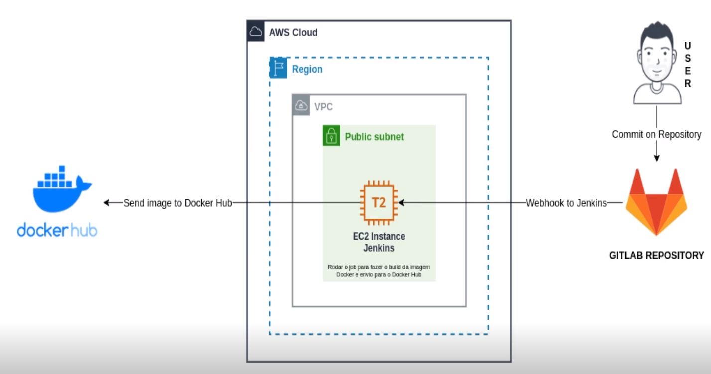

# Habilidades

As habilidades exercitadas nesse desafio serão:

. gitlab

. dockerfile

. jenkins

. dockerhub

---

# Passo a passo

A seguir as instruções que dever ser seguidas para completar o desafio:

- criar dokerfile (app qualquer, página web simples)

- versionar no gitlab (configurar webhook para conectar jenkins)

- criar jenkins no ec2 aws

- criar job no jenkins: quando houver um commit gitlab ele deve avisar o jenkins (através webhook) e o job jenkins iniciado.

Job deve fazer a seguinte tarefa:

    * clonar repo gitlab

    * fazer o build da imagem docker partindo do dockerfile

    * enviar a imagem pronta para o dockerhub

    * apagar a imagem da instância jenkins (dentro do próprio pipeline)

---

# Topologia

Topologia do desafio.

---

# Links úteis

Links úteis para concluir o desafio.

https://docs.docker.com/engine/install/

https://www.jenkins.io/doc/book/installing/

https://plugins.jenkins.io/gitlab-plugin/

https://docs.gitlab.com/ee/integration/jenkins.html
